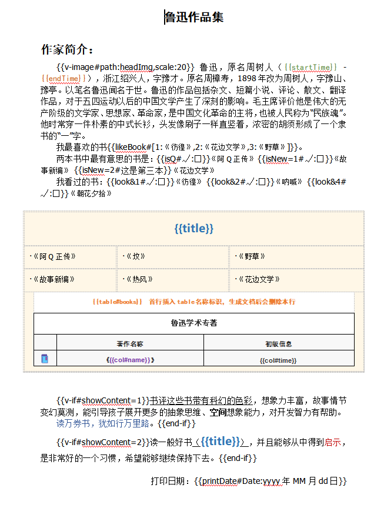
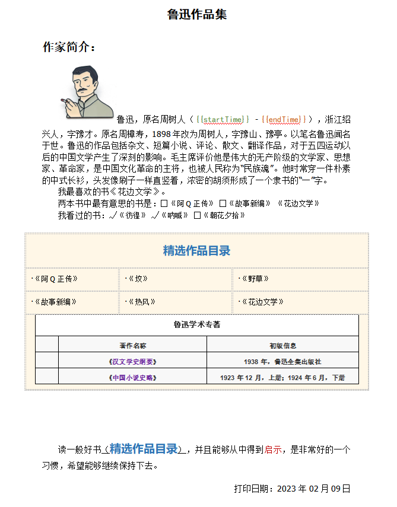

  

    
    
    
    

# NiceDoc

快速、高效、优雅地利用word、excel模板，根据相关标识自动生成相应格式的优美文档工具。

.Net 版本移步 https://github.com/miracleren/NiceDoc.Net
Android 示例 https://github.com/miracleren/NiceDoc.Android.Example

# 🧐 docx 模板生成Word文档说明 

## word模板

resources/Template/test.docx 示例模板 目前只支持docx格式的word模板导出，模板格式如下：

## 示例代码

        //测试示例模板
        String path = Main.class.getClassLoader().getResource("Template").getPath() + "/";
        try {
            path = URLDecoder.decode(path, "UTF-8");
        } catch (Exception e) {
            e.printStackTrace();
        }
        NiceDoc docx = new NiceDoc(path + "test.docx");

        Map<String, Object> labels = new HashMap<>();
        //值标签
        labels.put("startTime", "1881年9月25日");
        labels.put("endTime", "1936年10月19日");
        labels.put("title", "精选作品目录");
        labels.put("press", "鲁迅同学出版社");

        //枚举标签
        labels.put("likeBook", 2);
        //布尔标签
        labels.put("isQ", true);
        //等于
        labels.put("isNew", 2);
        //多选二进制值
        labels.put("look", 3);
        //if语句
        labels.put("showContent", 2);
        //日期格式标签
        labels.put("printDate",new Date());

        labels.put("fileReceiveBy", "陈先生");
        labels.put("fileRelation", 2);
        labels.put("fileDate", new Date());

        //添加头像
        labels.put("headImg","D:/head.png");

        docx.pushLabels(labels);

        //表格
        List<Map<String, Object>> books = new ArrayList<>();
        Map<String, Object> book1 = new HashMap<>();
        book1.put("name", "汉文学史纲要");
        book1.put("time", "1938年，鲁迅全集出版社");
        books.add(book1);
        Map<String, Object> book2 = new HashMap<>();
        book2.put("name", "中国小说史略");
        book2.put("time", "1923年12月，上册；1924年6月，下册");
        books.add(book2);
        docx.pushTable("books", books);

        //生成文档
        docx.save(path, UUID.randomUUID() + ".docx");

## 生成文档

# NiceDoc 目前支持相关标签说明

## 标签填充

#### 格式

{{label}}

#### 说明

标签用双大括号，标签名称与实体类（或 Map）的关键字必须大小写一至即可填充。标签样式（字体，颜色，字号等）都会保留。
 支持填充正文内容、面眉、页脚、及表格里面的标签。

## 表格填充

#### 格式

表头必须添加 {{table#books}} ，books为表的名称数据生成后，该行会自动删除
 表行数据 {{col#name}} ，name为数据表列名

#### 说明

表格生成，会保留表格里的相关格式，行会根据相关数据数量自动增加。

## 枚举标签填充

#### 格式

{{label#[1:《彷徨》,2:《花边文学》,3:《野草》]}}

#### 说明

标签用双大括号，标签名称与实体类（或 Map）的关键字必须大小写一至即可填充。
[]为枚举数组，“1：《彷徨》” 1为该枚举值，:号后“《彷徨》”为枚举的别名，即填充值。

## 布尔标签填充

#### 格式

{{label#√:□}}

#### 说明

标签用双大括号，标签值必须为true或false，井号后是对应true：false的填充值。 值可以只保留一个true值，如：{{label#√}}，false时就空。

## 等号判断标签填充

#### 格式

{{label=1#爱情:友情}}

#### 说明

标签用双大括号，标签label值如与等号对应值是否相等，则会填充井号对应true：false的填充值。 值可以只保留一个true值，如：{{label=1#爱情}}，false时就空。

## 位与运算判断标签填充

#### 格式

{{label&2#爱情:友情}}

#### 说明

标签用双大括号，标签label值如为多选（1、2、4、8、16值的和，即二进制位对应01是否选定），如label值为10时，label&2则为true，相应会填充true对应的值。
值可以只保留一个true值，如：{{label&2#爱情}}，false时就空。

## 图片标签填充

#### 格式

{{v-image#path:headImg,scale:20}}

#### 说明

标签用双大括号，标签头为v-image，path值为图片的绝对路径，scale为图片的缩放比例值，默认为100原图；
同时支持直接写{{v-image#path:headImg,size:50*50}}，其中值如size:width*height。

## 逻辑判断if标签填充

#### 格式

{{v-if#showContent=1}} {{end-if}}

#### 说明

标签用双大括号，标签包含开始与结束标签，如标签值showContent=1成立，则包含内容显示，否则内容将删除。 逻辑判断支持： {{v-if#showContent}}，showContent布尔类型；
{{v-if#showContent=1}}，showContent值等于运算； {{v-if#showContent&1}}，showContent值位与运算；

## 日期格式标签填充

#### 格式

{{printDate#Date:yyyy年MM月dd日}}

#### 说明

标签用双大括号，Date:后为日期格式，printDate传入类型必须为Date类型。

## 注意：如果标签替换出现问题或替换不完整，可以尝试在word模板上按ctrl+f，调出查找替换功能，如标签为 {{printDate#Date:yyyy年MM月dd日}}，则输入查找内容 {{printDate#Date:yyyy年MM月dd日}}，替换同内容{{printDate#Date:yyyy年MM月dd日}}，点全部替换再尝试即可。

# 🚀 xlsx 模板生成Excel文档说明 

## excel模板

resources/Template/test.xlsx 示例模板 目前只支持xlsx格式的Excel模板导出，模板格式如下：

## 示例代码
        //测试示例模板生成word
        NiceExcel excel = new NiceExcel(path + "test.xlsx");

        Map<String, Object> labels = new HashMap<>();
        //值标签
        labels.put("date", "2023年1月1日");
        labels.put("title", "精选作品统计");
        //枚举标签
        labels.put("likeBook", 2);
        //多选二进制值
        labels.put("lookType", 3);
        //if语句
        labels.put("showBanner", 1);
        //日期格式标签
        labels.put("printDate", new Date());
        excel.pushLabels(labels);

        //表格
        List<Map<String, Object>> books = new ArrayList<>();
        for (int i = 0; i <= 10; i++) {
            Map<String, Object> book = new HashMap<>();
            book.put("name", "汉文学史纲要" + i);
            book.put("time", 1900 + i + "年");
            book.put("intro", "简明扼要的介绍，本书是一本好书，推荐" + i + "星");
            book.put("byName", "作者" + i + "号");
            book.put("pages", i * 100);
            books.add(book);
        }
        excel.pushTable("books", books);

        //生成文档
        excel.save(path, UUID.randomUUID() + ".xlsx");

## 生成excel文档如下

# NiceExcel 目前支持相关标签说明

## 标签填充 （参考word）
## 枚举标签填充（参考word）
## 布尔标签填充（参考word）
## 等号判断标签填充（参考word）
## 位与运算判断标签填充（参考word）
## 图片标签填充（暂不支持）
## 逻辑判断if标签填充（不能跨格子）
## 日期格式标签填充（参考word）

## 表格填充

#### 格式

表格自动填充标识首行必须添加 {{books/col#name}} ，books为表的名，其它表格列数据格式如{{col#intro}}，字段名intro为填充数据对应的key值。
表格数据会根据填充的List数据数量自动扩充，所有列表信息，必需在同一行才有效。

#### 说明

表格生成，会保留表格里的相关格式，行会根据相关数据数量自动增加，而且不会影响表格前面其它数据。

## 表格公式，如图表实列，其中最大页码数、页码平均数、书本数均为公式
表格原有的公式，会在填充后继续保留，但公式对应必需要活动的，不是统计分析固定列，可参考实列excel。

## 🎉 感谢 

- 欢迎你提交问题。